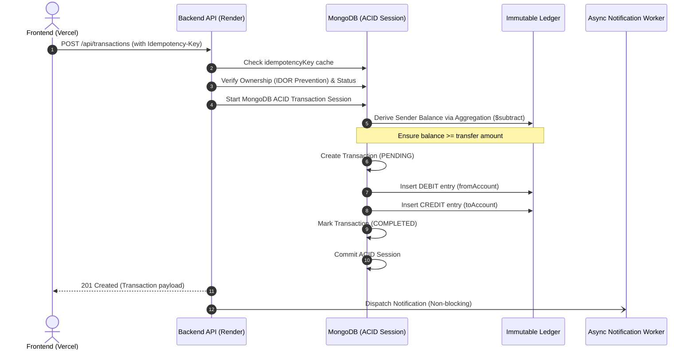

# LedgerFlow – Distributed Double-Entry Financial Ledger Engine

A production-grade financial ledger engine and fintech visualizer with a decoupled **Backend (Node.js/Express/MongoDB)** and **Frontend (Vercel-ready Fintech Dashboard)**, implementing strict double-entry bookkeeping, ACID multi-document transactions, cryptographic idempotency, and real-time ledger audit trails.

---

## 📁 Repository Structure

```
backend-ledger/
├── backend/                  # Node.js Express REST API & Ledger Engine
│   ├── .env.example          # Template for backend environment variables
│   ├── server.js             # Application entrypoint
│   ├── src/
│   │   ├── config/           # Database connections
│   │   ├── controllers/      # Auth, Account, Transaction controllers
│   │   ├── middleware/       # Auth, Error, Zod validation middleware
│   │   ├── models/           # User, Account, Ledger, Transaction models
│   │   ├── routes/           # REST endpoints
│   │   ├── services/         # Async notification worker
│   │   └── validators/       # Strict Zod schemas
│   └── tests/                # Jest & Supertest integration suite (16/16 passed)
│
├── frontend/                 # Interactive Fintech Dashboard (Vercel Ready)
│   ├── .env.example          # Frontend environment variables template
│   ├── index.html            # Main dashboard UI
│   ├── css/
│   │   └── style.css         # Fintech dark theme design system
│   ├── js/
│   │   ├── app.js            # Reactive client application logic
│   │   └── config.js         # Runtime backend connection configuration
│   └── vercel.json           # Vercel deployment & SPA routing configuration
│
├── .gitignore                # Global git ignore
└── README.md                 # Complete documentation & deployment guide
```

---

## 🏛 Architecture Overview

Traditional naive financial apps mutate a single balance column (`balance += amount`). This leads to discrepancies, race conditions, and zero auditability. 

**LedgerFlow** implements a **Double-Entry Bookkeeping Ledger**:
* **Every transaction creates paired DEBIT and CREDIT entries.**
* **Zero net change:** Total Debits = Total Credits across the entire system.
* **Derived State:** Account balances are never stored as mutable numbers. Instead, they are dynamically aggregated on-the-fly from immutable ledger logs (`totalCredit - totalDebit`).
* **Immutability:** Mongoose schema hooks strictly reject `update`, `delete`, and `remove` operations on ledger records.



---

## 📧 Asynchronous Notification Worker & Email Architecture

LedgerFlow features an event-driven, decoupled email notification worker implemented with **Nodemailer**:

* **Non-Blocking Architecture:** Email dispatch is completely decoupled from MongoDB ACID transaction commits (`sendEmail().catch(...)`). Slow SMTP/network handshakes never block ledger journal writes or delay user responses.
* **Dual Authentication Compatibility:**
  * **OAuth 2.0 Ready:** The codebase includes a full **Google Cloud OAuth 2.0** transporter implementation accepting `CLIENT_ID`, `CLIENT_SECRET`, and `REFRESH_TOKEN`.
  * **App Password / Dedicated SMTP (Selected for Live Deployment):** For continuous live hosting (e.g. Render/Vercel), a dedicated **Gmail App Password** (`EMAIL_PASS`) is configured.
* **Why App Password over OAuth 2.0 Playground Tokens for Deployment?**
  * Under Google Cloud's OAuth security policy, projects in "Testing" mode **automatically revoke and expire refresh tokens after 7 days**.
  * To guarantee that recruiters and evaluators can test the live demo at any time without encountering expired token failures, the live deployment uses an App Password to ensure **100% uptime and reliable delivery** directly to reviewers' inboxes.

---

## 💻 Interactive Frontend Dashboard

* **One-Click Recruiter Demo Access:** Instantly launches an authenticated session pre-seeded with test accounts and demo funds so reviewers don't need to fill forms.
* **Live Derived Balance Visualizer:** Calculates net worth and per-account balances dynamically from underlying ledger journals.
* **Real-Time Double-Entry Audit Drawer:** Click on any account to view the immutable ledger statement (DEBIT entries in crimson, CREDIT entries in emerald).
* **Testnet Faucet:** Allows testers to deposit +₹1,000 demo funds to test transfers on live deployments.
* **Idempotency Guard UI:** Displays and auto-generates cryptographic idempotency keys (`idemp_xxxx`) for every transfer.
* **Account Controls:** One-click Freeze/Unfreeze status toggling.

---

## 🌐 Deploying to the Cloud (Render + Vercel)

### Step 1: Deploy Backend to Render (Free)
1. Push this repository to your GitHub account.
2. Go to [Render.com](https://render.com) $\rightarrow$ **New Web Service**.
3. Select your repository.
4. Fill in the deployment settings:
   * **Root Directory:** `backend`
   * **Build Command:** `npm install`
   * **Start Command:** `npm start`
5. Under **Environment Variables**, add:
   * `MONGO_URI` = *(your MongoDB Atlas connection string)*
   * `JWT_SECRET` = *(any random secret string)*
   * `NODE_ENV` = `production`
   * *(Optional for live email notifications)*: `EMAIL_USER` and `EMAIL_PASS` (16-char Gmail App Password)
6. Click **Deploy**. Copy your live backend URL (e.g. `https://ledgerflow-backend.onrender.com`).

---

### Step 2: Deploy Frontend to Vercel (Free)
1. Go to [Vercel.com](https://vercel.com) $\rightarrow$ **Add New Project**.
2. Select your repository.
3. In the configuration screen:
   * **Root Directory:** Click **Edit** and select **`frontend`**.
   * Leave Build & Output settings default (Vercel automatically detects `frontend/vercel.json`).
4. Click **Deploy**.
5. Once deployed, open your live Vercel link (`https://ledgerflow.vercel.app`):
   * Click the **`ACID Engine: Online ⚙`** indicator in the header.
   * Paste your Render backend URL (e.g. `https://ledgerflow-backend.onrender.com`) and click **OK**.
   * *(Alternatively, paste it into `frontend/js/config.js` before pushing!)*

---

## 🛠 Local Development

### 1. Start the Backend
```bash
cd backend
cp .env.example .env
npm install
npm run dev
```
Backend runs at `http://localhost:3000`.

### 2. Run the Frontend
You can open `frontend/index.html` directly in your browser or run any static server:
```bash
cd frontend
# Using Python, npx serve, or VS Code Live Server
npx serve .
```

### 3. Run Automated Tests
The backend integration test suite runs via Jest with an in-memory MongoDB replica set:
```bash
cd backend
npm test
```
All **16/16 tests pass** covering idempotency, IDOR authorization, ACID transactions, and ledger immutability.
